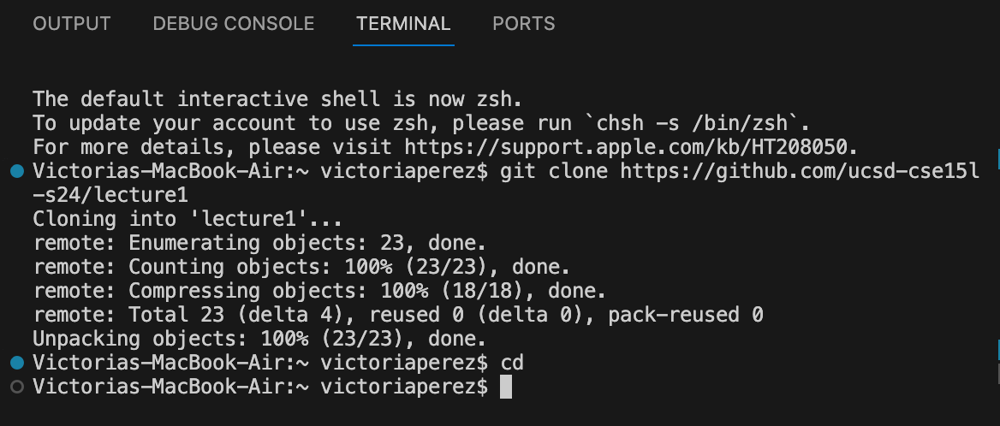
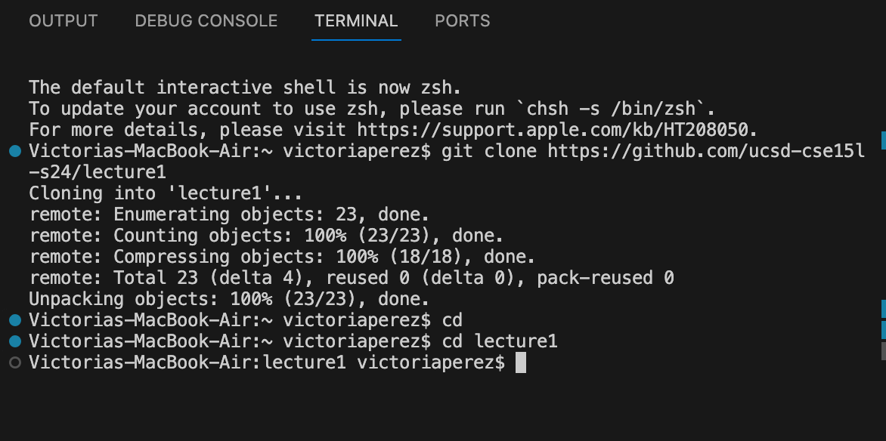
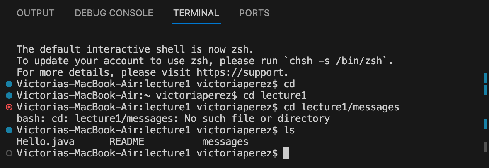
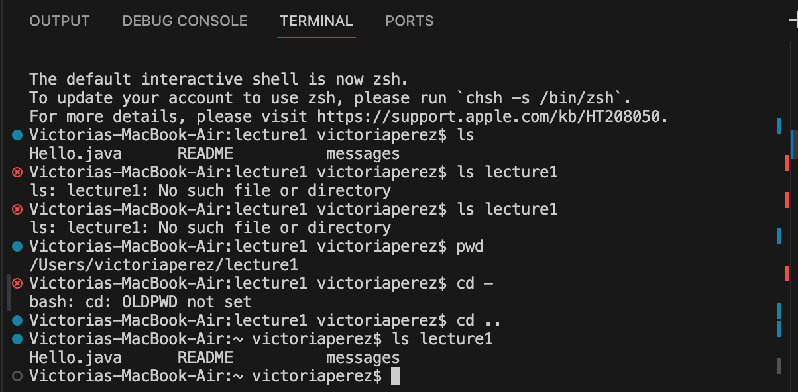
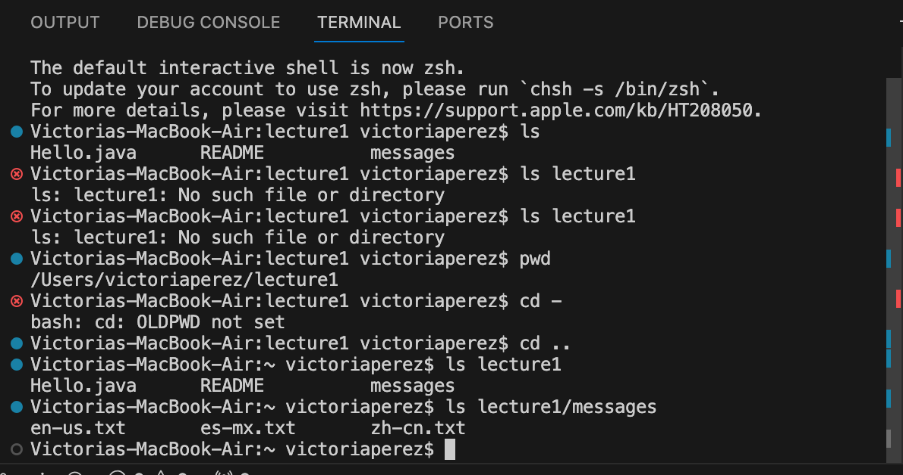
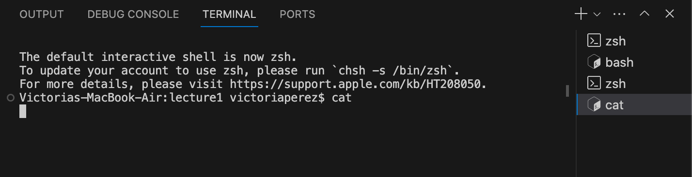
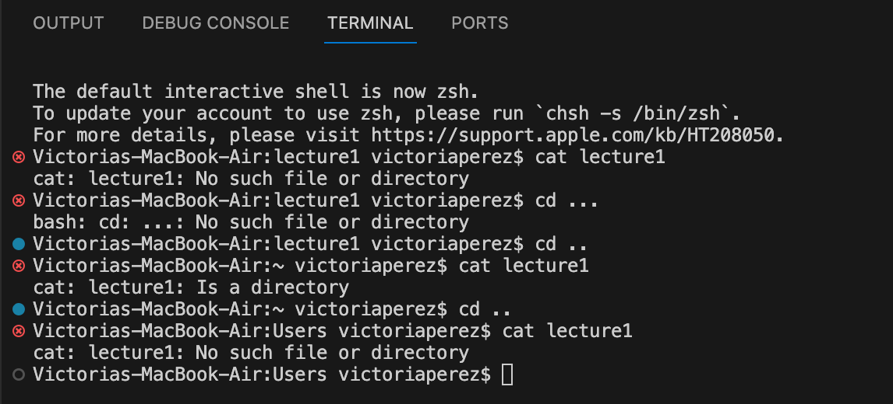
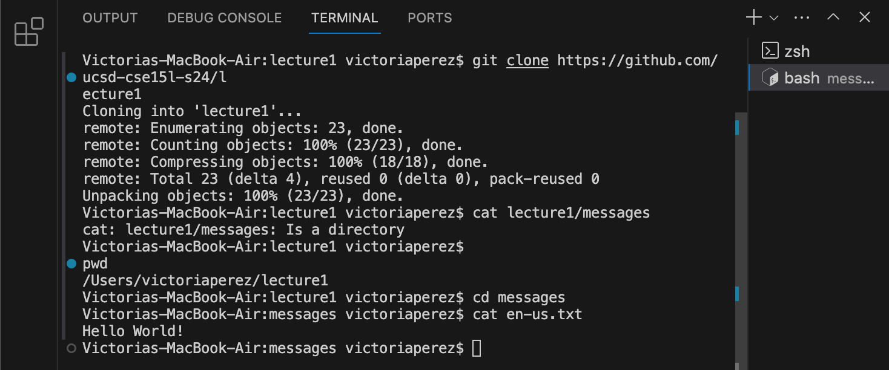

1. no argument (cd)

The absolute path to the working directory right before the command was ran was /Users/victoriaperez because it was ran on a mac.
I got this output because that is the current directory was the same as the home directory.
Not an error.

2. command with a path to a directory as an argument (cd)

The absolute path to the working directory right before the command was ran was /Users/victoriaperez.
I got this output because it changed the current directory, victoriaperez to the lecture1 directory. 
Not an error.

3. command with a path to a file as an argument (cd)

The absolute path to the working directory right before the command was ran was /Users/victoriaperez/lecture1.
I got this output because it changed the current directory, lecture1 to the messages directory.
Not an error.

4. no argument (ls)

The absolute path to the working directory right before the command was ran was /Users/victoriaperez/lecture1.
I got this output because it printed the information from the files and directories within the system.
Not an error.

5. command with a path to a directory as an argument (ls)

The absolute path to the working directory right before the command was ran was /Users/victoriaperez/lecture1.
I got this output because it printed the content in the lecture1 directory.
Not an error.  

6. command with a path to a file as an argument (ls)

The absolute path to the working directory right before the command was ran was /Users/victoriaperez/lecture1.
I got this output because it printed the content inside the messages diretory. 
Not an error.

7. no argument (cat)

The absolute path to the working directory right before the command was ran was /Users/victoriaperez/lecture1.
I got this output because 'cat' needs to have at least 1 file to be used.
This output is an error because 'cat' expects at least one file argument.

8. command with a path to a directory as an argument (cat)

The absolute path to the working directory right before the command was ran was /Users/victoriaperez/lecture1.
I got this output because 'cat' doesn't work on directories. 
This output is an error because 'cat' can't operate on directories.
  
  

9. command with a path to a file as an argument (cat)
      
The absolute path to the working directory right before the command was ran was /Users/victoriaperez/lecture1/messages.
I got this output because I changed the directory to messages prior to using the command 'cat' so that it would print the content of the en-us.txt file. 
Not an error.

