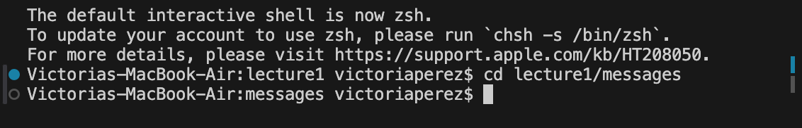

1. no argument (cd)

2. command with a path to a directory as an argument (cd)
   

4. command with a path to a file as an argument (cd)

1. no argument (ls)
   

3. command with a path to a directory as an argument (ls)
   

5. command with a path to a file as an argument (ls)
   

1. no argument (cat)
   

3. command with a path to a directory as an argument (cat)
   

5. command with a path to a file as an argument (cat)

