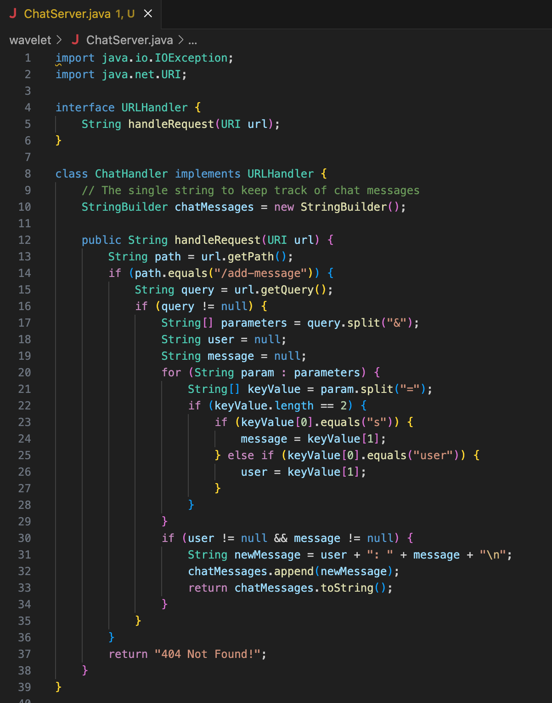
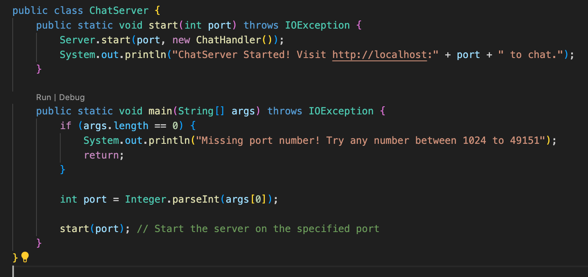
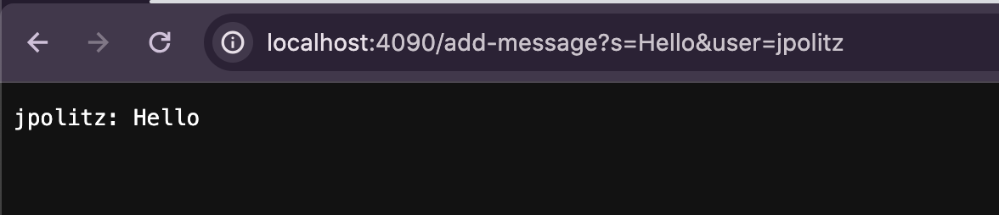
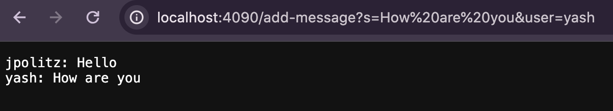

Part 1:
ChatServer code

Screenshot 1 - /add-message?s=Hello&user=jpolitz

1. The methods called are 'handleRequest(URI url)', 'url.getPath()', 'url.getQuery()','query.split("&")', 'param.split("=")', 'keyValue[0].equals("s")', 'keyValue[0].equals("user")', 'chatMessages.append(newMessage)', 'return chatMessages.toString()'.
2. 'handleRequest(URI url)' is relevant in representing the request URL, it's relevant in 'chatMessages'. 'chatMessages.append(newMessage) 'method is called, the new chat message created from the user name and message content.The 'query.split("&")' method has the argument of the query string obtained from the URL. The 'param.split("=")' method has the argument of each parameter string obtained from the previous split. 'The keyValue[0].equals("s")' and 'keyValue[0].equals("user")' methods have the arguments of the key part of each parameter.
3.The 'chatMessages' field gets updated by adding the new message and the 'handleRequest(URI url)' updates the 'chatMessages' field if the request is valid by adding the new message.

Screenshot 2 - /add-message?s=How are you&user=yash

1. The methods called are 'handleRequest(URI url)', 'url.getPath()', 'url.getQuery()','query.split("&")', 'param.split("=")', 'keyValue[0].equals("s")', 'keyValue[0].equals("user")', 'chatMessages.append(newMessage)', 'return chatMessages.toString()'.
2. 'handleRequest(URI url)' is relevant in representing the request URL, it's relevant in 'chatMessages'. 'chatMessages.append(newMessage) 'method is called, the new chat message created from the user name and message content.The 'query.split("&")' method has the argument of the query string obtained from the URL. The 'param.split("=")' method has the argument of each parameter string obtained from the previous split. 'The keyValue[0].equals("s")' and 'keyValue[0].equals("user")' methods have the arguments of the key part of each parameter.
3.The 'chatMessages' field gets updated by adding the new message and the 'handleRequest(URI url)' updates the 'chatMessages' field if the request is valid by adding the new message.

Part 2:

Part 3:
I've learned how to get on a browser using the terminal. I've also learned how to use curl to display the contents of files in the terminal so I don't need to open a browser. 

