Part 1: 

   (1).
   @Test
    public void testFilterFail() {
        List<String> inputList = new ArrayList<>();
        inputList.add("apple");
        inputList.add("banana");
        inputList.add("orange");

        StringChecker alwaysTrueChecker = s -> true;

        List<String> filteredList = ListExamples.filter(inputList, alwaysTrueChecker);

        assertEquals(inputList, filteredList);
    }

(2).
   @Test
    public void testFilterPass() {
        List<String> inputList = new ArrayList<>();
        inputList.add("apple");
        inputList.add("banana");
        inputList.add("orange");

        StringChecker alwaysFalseChecker = s -> false;

        List<String> filteredList = ListExamples.filter(inputList, alwaysFalseChecker);

        assertTrue(filteredList.isEmpty());
    }
  
(3). 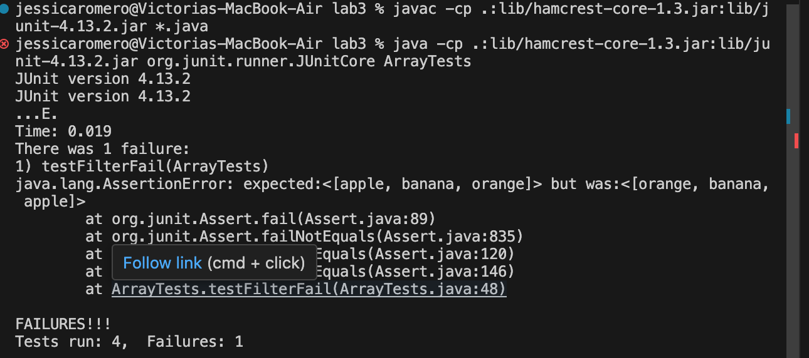
   
(4). The bug
   before -

after -
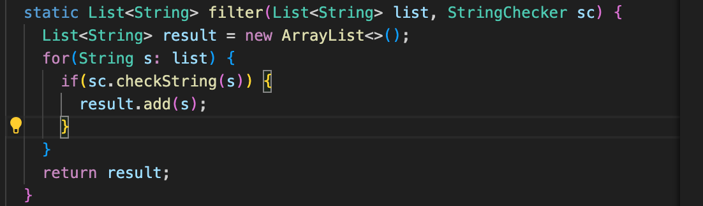
terminal after -
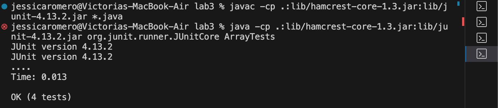

(5).In the 'filter' method the elements were being added incorrectly because they weren't only being added to the end of the list, they were also being added to the beginning so the list was reversed. The erasure of the index 0 part ensures that the order is correct because it is only adding to the end of the list. 

Part 2: 
grep functions

(1). grep -i
* 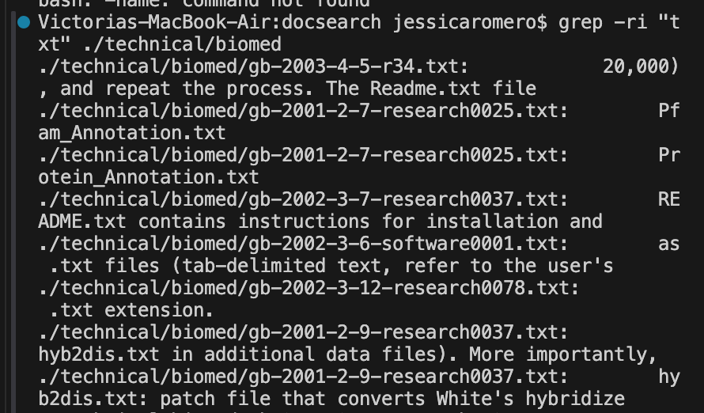
  - This command ignores the case. It's useful when you're searching for something regardless of case. Here it is ignoring the case of "txt" in the 'biomed' directory.
  - source: https://www.digitalocean.com/community/tutorials/grep-command-in-linux-unix
* 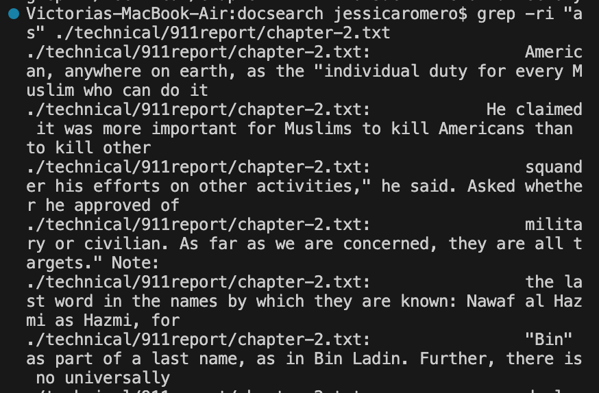
  - This command ignores the case. It's useful when you're searching for something regardless of case. In this instance "as" is
  - source: https://www.digitalocean.com/community/tutorials/grep-command-in-linux-unix

(2). grep -v
* 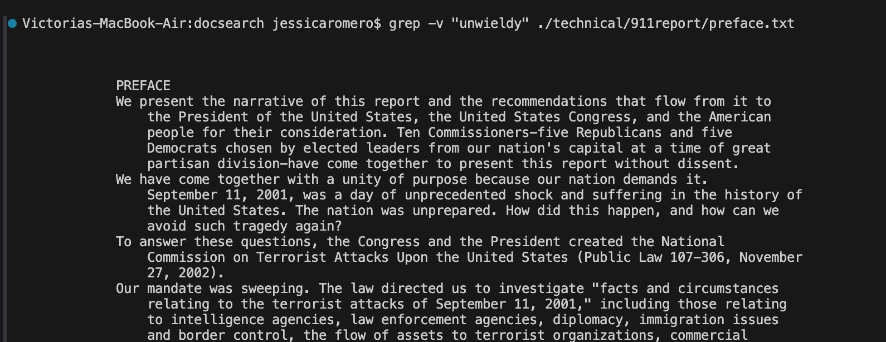
  - This command finds lines that don't match, it essentially prints lines that don't contain the specified pattern. Here that pattern is 
  - source: https://www.digitalocean.com/community/tutorials/grep-command-in-linux-unix
* 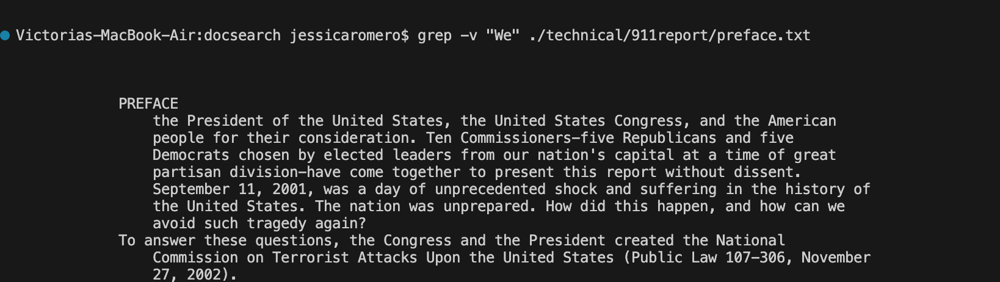
  - It's
  - source: https://www.digitalocean.com/community/tutorials/grep-command-in-linux-unix

(3). grep -n
* 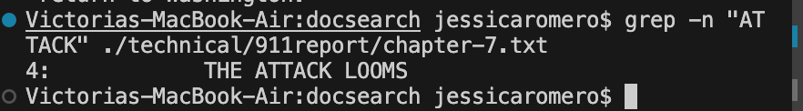
  - It's
  - source: https://www.digitalocean.com/community/tutorials/grep-command-in-linux-unix
* 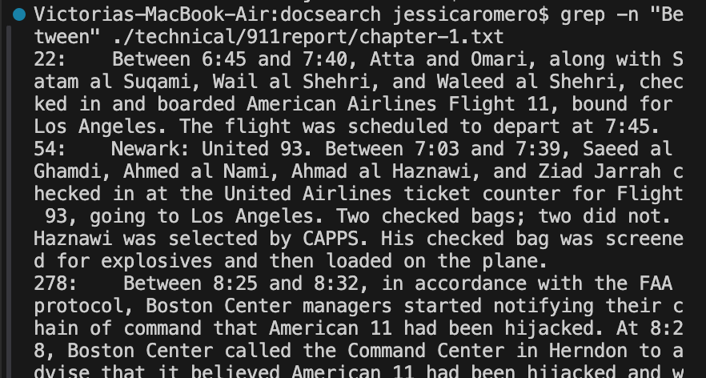
  - It's
  - source: https://www.digitalocean.com/community/tutorials/grep-command-in-linux-unix

(4). grep -l
* 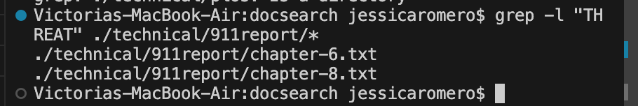
  - It's
  -  source: https://www.cyberciti.biz/faq/howto-use-grep-command-in-linux-unix/
* 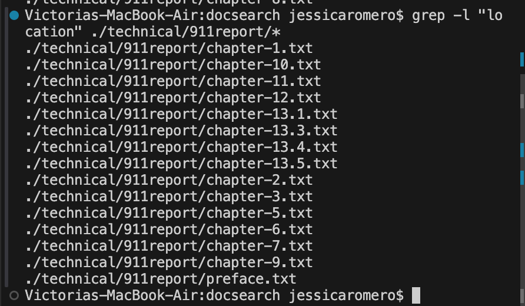
  - It's
  - source: https://www.cyberciti.biz/faq/howto-use-grep-command-in-linux-unix/

