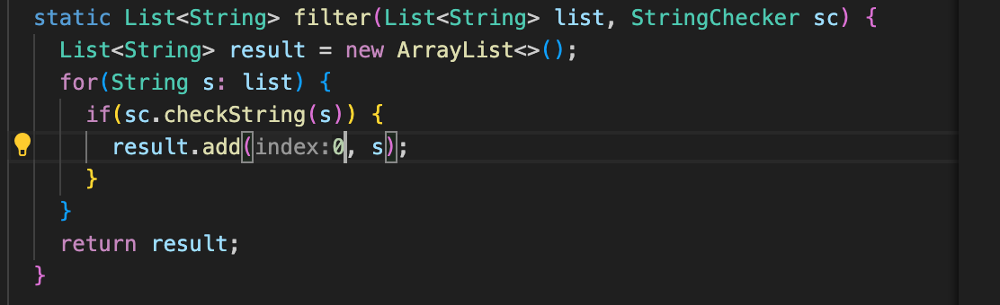

1.
   @Test
    public void testFilterFail() {
        List<String> inputList = new ArrayList<>();
        inputList.add("apple");
        inputList.add("banana");
        inputList.add("orange");

        StringChecker alwaysTrueChecker = s -> true;

        List<String> filteredList = ListExamples.filter(inputList, alwaysTrueChecker);

        assertEquals(inputList, filteredList);
    }

2.
   @Test
    public void testFilterPass() {
        List<String> inputList = new ArrayList<>();
        inputList.add("apple");
        inputList.add("banana");
        inputList.add("orange");

        StringChecker alwaysFalseChecker = s -> false;

        List<String> filteredList = ListExamples.filter(inputList, alwaysFalseChecker);

        assertTrue(filteredList.isEmpty());
    }
3. 
4. The bug
   before -

after -

terminal after -

5.

